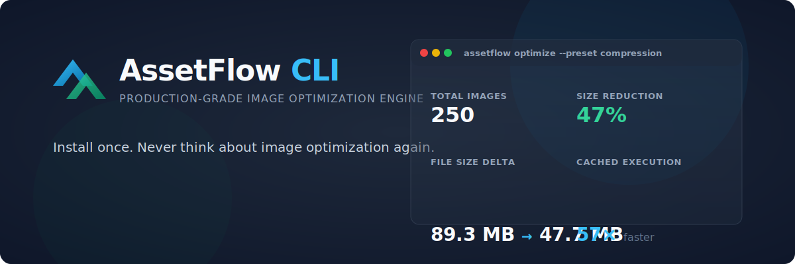
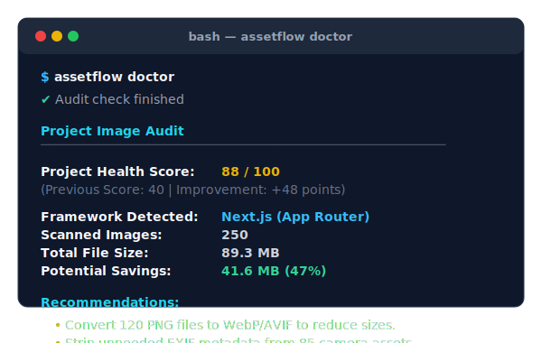
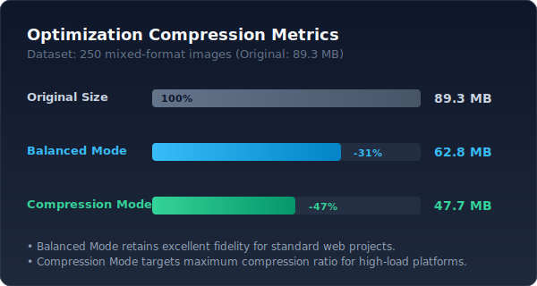
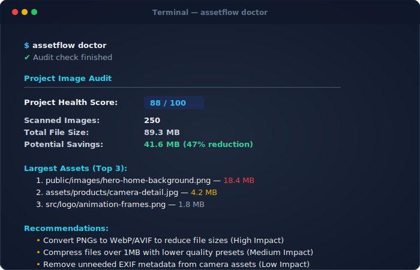
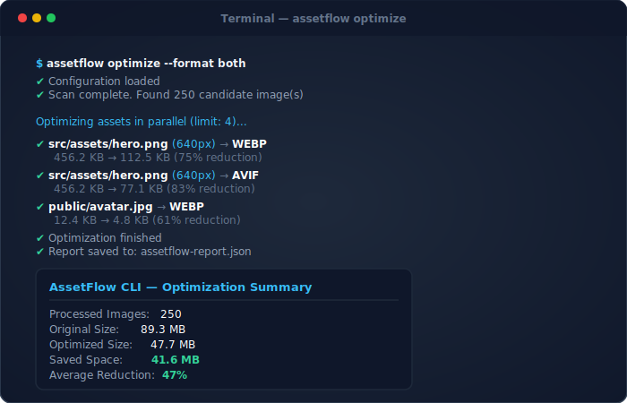
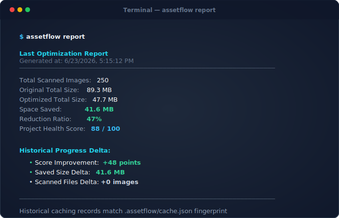
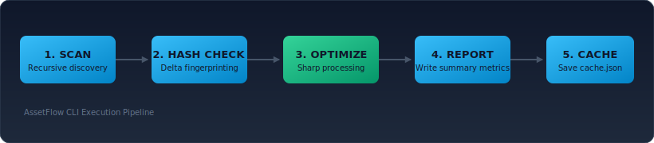

# AssetFlow CLI

<p align="center">
  
</p>

<p align="center">
  <strong>Install once. Never think about image optimization again.</strong>
</p>

<p align="center">
  <a href="https://www.npmjs.com/package/assetflow-cli">
    
  </a>
  <a href="https://www.npmjs.com/package/assetflow-cli">
    
  </a>
  <a href="LICENSE">
    
  </a>
</p>

---

## 🚀 Quick Start & Installation

Install globally to audit and optimize images across any project root:

```bash
npm install -g assetflow-cli

# Run an audit
assetflow doctor

# Optimize images in-place
assetflow optimize
```

---

AssetFlow CLI is a zero-configuration, production-grade image optimization tool designed for modern web applications. It recursively scans your project, detects frameworks, compresses and converts images to WebP/AVIF formats, generates responsive variants, and strips unneeded metadata—saving disk space and optimizing loading speed in local and CI environments.

---

## ⚡ Terminal Demo

Run `assetflow doctor` to audit your project's current image health:

<p align="center">
  
</p>

---

## 📊 Benchmark Dashboard

AssetFlow CLI processes high-throughput folders concurrently (up to 4 files simultaneously) while maintaining excellent visual quality:

<p align="center">
  
</p>

*Benchmarks based on a dataset of **250 images** (PNG & JPEG):*

| Mode | Target Quality | Average Size Reduction | Space Saved |
| :--- | :--- | :--- | :--- |
| **Balanced** | `80` | **31% Reduction** | 27.8 MB |
| **Compression** | `50` | **47% Reduction** | 41.6 MB |

---

## ✨ Features

<table>
  <tr>
    <td width="50%">
      <h3>🖼️ Multi-Format Output</h3>
      Compress and convert standard images to <code>WebP</code>, <code>AVIF</code>, or compile <code>both</code> formats concurrently.
    </td>
    <td width="50%">
      <h3>📐 Responsive Variants</h3>
      Automatically generate aspect-ratio preserving width scaling (e.g. <code>-640</code>, <code>-1280</code> suffixes) without pixel upscaling.
    </td>
  </tr>
  <tr>
    <td>
      <h3>⚡ SHA-256 Hash Caching</h3>
      Fingerprints image checksums in <code>.assetflow/cache.json</code> to instantly skip unchanged images on subsequent runs.
    </td>
    <td>
      <h3>🩺 Graded Health Doctor</h3>
      Runs deterministic scoring audits, deducts points for optimizations bottlenecks, and logs ranked actionable recommendations.
    </td>
  </tr>
  <tr>
    <td>
      <h3>🌱 Git Changed Filters</h3>
      Optimize only modified, staged, or untracked images in local branches to speed up pre-commit verification hooks.
    </td>
    <td>
      <h3>⏱️ Real-Time Watch Daemon</h3>
      Monitors target directories recursively to optimize newly added or updated assets in real-time.
    </td>
  </tr>
  <tr>
    <td>
      <h3>🤖 Auto-Framework Detection</h3>
      Discovers configuration styles for <b>Next.js</b>, <b>React</b>, <b>Vite</b>, <b>Vue</b>, and <b>Astro</b> out-of-the-box.
    </td>
    <td>
      <h3>🛡️ Metadata Stripping</h3>
      Removes unneeded Exif camera profiles, GPS details, and color profiles to strip bytes and protect privacy.
    </td>
  </tr>
</table>

---

## 💻 Commands

### `assetflow init`
Creates a default `assetflow.config.json` configuration file in your project root with sensible default settings.
```bash
npx assetflow init
```

### `assetflow doctor`
Runs a project-wide audit, lists largest file sizes, calculates a Health Score, and gives recommendations.
```bash
npx assetflow doctor
```
<p align="center">
  
</p>

### `assetflow optimize`
Discovers and optimizes target image folders.
```bash
# Standard optimize run
npx assetflow optimize

# Force compression preset quality level overrides
npx assetflow optimize --quality 50 --preset compression

# Reprocess all files, ignoring cached checksum hashes
npx assetflow optimize --force
```
<p align="center">
  
</p>

### `assetflow report`
Displays comparison delta progress statistics from the last optimization run compared to cached statistics.
```bash
npx assetflow report
```
<p align="center">
  
</p>

### `assetflow watch`
Monitors directories and automatically optimizes images on `add` or `change` events.
```bash
npx assetflow watch
```

### `--changed`
Optimize only files currently modified, staged, or untracked in Git.
```bash
npx assetflow --changed
```

### `--dry-run`
Simulates scanner and compression runs, estimating total size savings without modifying or writing files.
```bash
npx assetflow --dry-run
```

---

## ⚙️ Configuration

Configure settings by placing an `assetflow.config.json` file in your project root:

```json
{
  "quality": 80,
  "format": "both",
  "deleteOriginal": false,
  "directories": ["src", "public"],
  "ignore": ["node_modules", ".next"],
  "preset": "balanced",
  "keepMetadata": false,
  "responsive": true,
  "sizes": [640, 1280]
}
```

### Options Schema Reference

| Property | Type | Default | Description |
|---|---|---|---|
| `quality` | `number` | `80` | Compression quality rating (1-100). |
| `format` | `"webp" \| "avif" \| "both"` | `"webp"` | Target format output extension. |
| `deleteOriginal` | `boolean` | `false` | Deletes source images after writing compressed formats. |
| `directories` | `string[]` | `["src", "public", "assets", "images"]` | Folder roots to scan recursively. |
| `ignore` | `string[]` | `["node_modules", ".next", "dist", "build", "coverage", ".git"]` | Directories to ignore. |
| `preset` | `"balanced" \| "quality" \| "compression"` | `"balanced"` | Quality encoding overrides. |
| `keepMetadata` | `boolean` | `false` | Preserves embedded EXIF data, camera tags, and ICC profiles. |
| `responsive` | `boolean` | `false` | Generates resized responsive widths. |
| `sizes` | `number[]` | `[640, 1280, 1920]` | Target width configurations to scale. |

---

## 🌐 Framework Support

AssetFlow CLI automatically supports standard repository structures:
* **Next.js**: Scans `public/` and `assets/` and auto-ignores `.next/`.
* **Vite**: Scans `public/` and `src/assets/`.
* **Astro**: Scans `public/` and `src/assets/` and auto-ignores `dist/`.
* **React / Vue**: Scans asset paths and updates cache records.

---

## 🏗️ Architecture

The flowchart below displays how image processing tasks propagate through the CLI:

<p align="center">
  
</p>

1. **Recursive Scan**: Scans configured paths for candidate files.
2. **SHA-256 Checksum**: Calculates individual file hash and checks `.assetflow/cache.json`.
3. **Sharp Engine**: Runs compression filters asynchronously (concurrency limit: 4).
4. **Report Exporter**: Writes optimization metrics summary to `assetflow-report.json`.
5. **Cache Sync**: Commits hashes and metrics to disk for subsequent runs.

---

## ❔ FAQ

#### Does AssetFlow modify original images?
No. By default, it preserves original files (e.g. `hero.png`) and writes `.webp` / `.avif` versions in the same folder. Set `"deleteOriginal": true` in `assetflow.config.json` if you want to delete source images.

#### How does caching work?
AssetFlow CLI calculates a SHA-256 hash of each source image and matches it against `.assetflow/cache.json`. If the hash matches and the output files exist, the file is skipped in less than 2ms.

#### Why WebP?
WebP provides superior lossless and lossy compression for web images, yielding ~25-35% smaller files compared to JPEG/PNG at similar quality.

#### Why AVIF?
AVIF offers state-of-the-art compression, saving up to ~50% in size compared to JPEG, and supports transparency, HDR, and wide color gamuts.

#### Can I disable metadata stripping?
Yes. Set `"keepMetadata": true` inside `assetflow.config.json` to keep camera tags, GPS coordinates, and embedded color profile parameters.

#### Does it support Next.js / React / Vite?
Yes. It supports Next.js, Vite, React, Vue, and Astro structures, avoiding temporary output directories (like `.next/` or `dist/`) automatically.

---

## 📄 License

AssetFlow Community Edition is source-available software licensed under the [AssetFlow Community License v1.0](LICENSE).

- **Personal & Educational Use**: Free to use, inspect, modify, and contribute back. See [LICENSE](LICENSE).
- **Commercial Use**: A paid commercial license is required for enterprise, startup, agency, or business production environments. See [COMMERCIAL_LICENSE.md](COMMERCIAL_LICENSE.md) for details.
- **Trademarks**: This license does not grant rights to use the AssetFlow name, logos, or brand identity. See [TRADEMARK.md](TRADEMARK.md) for branding policies.
- **Security Policy**: For reporting vulnerabilities and security guidelines, see [SECURITY.md](SECURITY.md).
