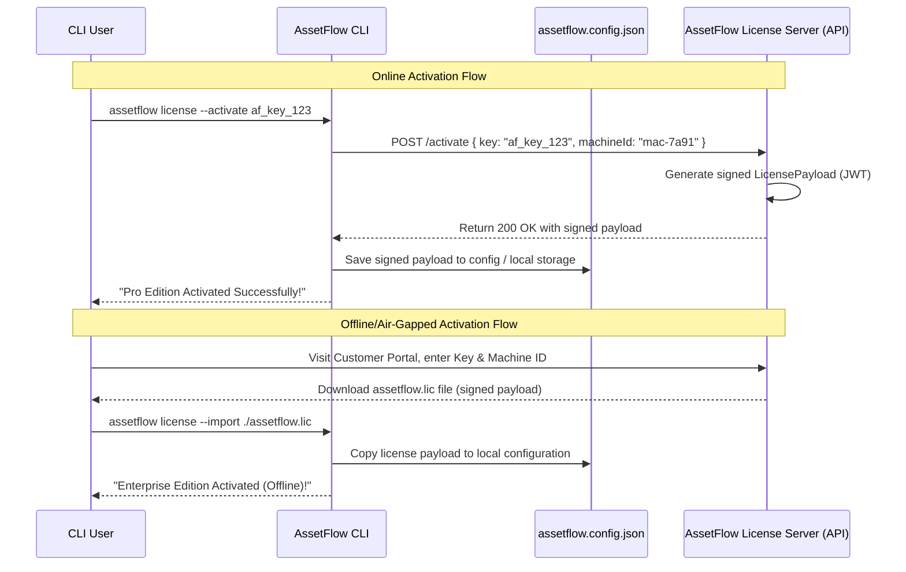

# Future Licensing Architecture (Phase 2 Design Specification)

This document outlines the proposed licensing architecture for Phase 2 of AssetFlow CLI. It is a planning-only specification and does not contain active implementation code.

---

## 1. Core Licensing Strategy

AssetFlow CLI will transition to a tiered feature and license model:

- **Community Edition**: Default mode, free for personal use, education, and evaluation. Requires no license key. Gated from advanced enterprise commands.
- **Personal Edition**: Paid or free tier for individual developers. Unlocks basic local optimizations without workspace seat caps.
- **Pro Edition**: Multi-seat developer license for agencies and growing startups. Unlocks priority local caches, advanced reporting, and watch integrations.
- **Enterprise Edition**: Dedicated corporate license with organization seat pooling, offline air-gapped activation, custom thresholds, and priority support entitlements.

---

## 2. Technical Architecture & Data Models

### 2.1 License Schema (JWT-based payload)

License verification will use cryptographically signed JSON Web Tokens (JWT) or custom payloads signed using RSA/Ed25519. This allows robust offline verification without exposing the validation algorithm.

```typescript
export interface LicensePayload {
  id: string;             // Unique license identifier
  owner: {
    name: string;
    email: string;
    organization?: string;
  };
  edition: 'personal' | 'community' | 'pro' | 'enterprise';
  status: 'valid' | 'expired' | 'suspended';
  issuedAt: string;       // ISO Date
  expiresAt: string;      // ISO Date
  maxSeats: number;       // Maximum developer seats
  entitlementVersion: string; // The maximum software version this key supports (e.g. "1.*.*")
  offlineSignature: string; // HMAC/RSA signature validating payload integrity
}
```

### 2.2 Activation Flows



#### Online Activation
The CLI makes an HTTPS POST request to `https://api.riish.in/v1/license/activate` with the license key and a hardware-locked fingerprint. The server returns a signed license payload, which is saved locally.

#### Offline Activation (Enterprise)
For secure/air-gapped networks, users generate a hardware identifier via `assetflow license status --machine-id`. They paste this into the AssetFlow online customer portal, which provides a signed license file (`assetflow.lic`). The user imports this file using `assetflow license --import <path/to/lic>`.

---

## 3. License Manager Integration

A `LicenseManager` class will orchestrate validation. It runs before command execution:

```typescript
export class LicenseManager {
  private static instance: LicenseManager;
  private currentLicense: LicensePayload | null = null;

  public static getInstance(): LicenseManager {
    if (!LicenseManager.instance) {
      LicenseManager.instance = new LicenseManager();
    }
    return LicenseManager.instance;
  }

  // Load and decrypt/verify local license configuration
  public async loadLicense(projectRoot: string): Promise<LicensePayload> {
    // 1. Read env variable: ASSETFLOW_LICENSE_KEY
    // 2. Read project config: assetflow.config.json -> licenseKey
    // 3. Read global file: ~/.config/assetflow/license.json
    // 4. Verify signature using public key embedded in binary
    // 5. If verification fails, fallback to Community Edition
  }

  // Gate commands based on license capability
  public isFeatureAllowed(feature: string): boolean {
    if (!this.currentLicense) return false;
    
    // Example gating rules:
    // "doctor" -> allowed for all
    // "enterpriseReport" -> requires enterprise edition
    // "parallelOptimizationLimit8" -> requires pro or enterprise
    return true;
  }

  // Validate if current CLI version is entitled to updates
  public verifyUpdateEntitlement(currentCliVersion: string): boolean {
    // Compare CLI version against license entitlementVersion range
  }
}
```

---

## 4. Feature Gating Matrix

| Feature / Command | Community | Personal | Pro | Enterprise |
| :--- | :---: | :---: | :---: | :---: |
| **assetflow init** | Yes | Yes | Yes | Yes |
| **assetflow doctor** | Yes | Yes | Yes | Yes |
| **assetflow optimize (up to 4 threads)** | Yes | Yes | Yes | Yes |
| **assetflow optimize (8+ threads)** | No | No | Yes | Yes |
| **assetflow watch** | Yes | Yes | Yes | Yes |
| **assetflow report (standard)** | Yes | Yes | Yes | Yes |
| **assetflow report (JSON/Export)** | No | Yes | Yes | Yes |
| **Custom Optimization Presets** | No | Yes | Yes | Yes |
| **Distributed Remote Caching** | No | No | No | Yes |
| **Priority CLI Support Email** | No | No | Yes | Yes |

---

## 5. Security & Tamper Prevention

To prevent trivial bypasses (e.g. users editing `licenseManager.js` to return `true` on everything):

1. **JS/TS Build Hardening**: During production packaging, compiled JS files are minified, obfuscated, and comments are stripped to make structural modification difficult.
2. **Signature Binding**: License keys are cryptographically signed payloads. The validation public key is embedded in the CLI binary.
3. **Periodical Online Verification**: Non-enterprise paid licenses check in with `https://api.riish.in` once every 14 days to check suspension status. If offline, the license remains active for a grace period before falling back to Community mode.
